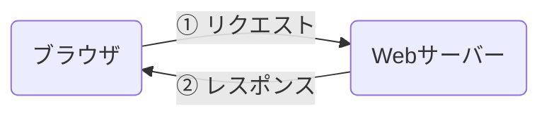

## Web とは？

ウェブブラウザ(Chrome, Safari, Edge, Firefox など)を使って見るアレです。URL で相互に参照できるという特徴があります(これをハイパーテキストと言います)

現在ではハイパーテキストの枠組みを超えて、アプリケーション基盤として利用されることも多いです(Twitter などの SNS や、Google Docs など)

### Web サイト の仕組み

たとえば https://example.com にアクセスした際に、どのように画面に内容を表示するのでしょうか。



これが簡略化した Web サイトの仕組みです。

HTTP という通信プロトコルを利用し、ブラウザから Web サーバーへリクエストをします。HTTP には複数のメソッドがあるのですが、この場合は GET リクエストになります。

Web サーバーはリクエストを受け取ると、様々な種類のファイルを返します。Web フロントという分野は、主にこの返ってくるファイルを作ります。そしてブラウザ上で画面表示を行ないます。

<details>
<summary>補足: リクエストとレスポンスの例</summary>

:::tip[補足]
一例ですが、リクエストとレスポンスは以下のようになっています。

```http title="リクエスト"
GET / HTTP/2
Host: example.com
user-agent: curl/7.81.0
accept: */*
```

```http title="レスポンス"
HTTP/2 200
age: 411227
cache-control: max-age=604800
content-type: text/html; charset=UTF-8
date: Sun, 12 May 2024 06:23:35 GMT
etag: "3147526947+ident"
expires: Sun, 19 May 2024 06:23:35 GMT
last-modified: Thu, 17 Oct 2019 07:18:26 GMT
server: ECAcc (sac/2545)
vary: Accept-Encoding
x-cache: HIT
content-length: 1256

<!doctype html>
<html>
<head>
    <title>Example Domain</title>

    <meta charset="utf-8" />
    <meta http-equiv="Content-type" content="text/html; charset=utf-8" />
    <meta name="viewport" content="width=device-width, initial-scale=1" />
    <style type="text/css">
    body {
        background-color: #f0f0f2;
        margin: 0;
        padding: 0;
        font-family: -apple-system, system-ui, BlinkMacSystemFont, "Segoe UI", "Open Sans", "Helvetica Neue", Helvetica, Arial, sans-serif;

    }
    div {
        width: 600px;
        margin: 5em auto;
        padding: 2em;
        background-color: #fdfdff;
        border-radius: 0.5em;
        box-shadow: 2px 3px 7px 2px rgba(0,0,0,0.02);
    }
    a:link, a:visited {
        color: #38488f;
        text-decoration: none;
    }
    @media (max-width: 700px) {
        div {
            margin: 0 auto;
            width: auto;
        }
    }
    </style>
</head>

<body>
<div>
    <h1>Example Domain</h1>
    <p>This domain is for use in illustrative examples in documents. You may use this
    domain in literature without prior coordination or asking for permission.</p>
    <p><a href="https://www.iana.org/domains/example">More information...</a></p>
</div>
</body>
</html>
```

:::

</details>

## Web フロント

Web サーバーが返すファイルには、主に HTML, CSS, JavaScript があります。Web フロントでは、これら 3 種類のファイルを用いて GUI の作成をします。

### HTML

HTML は Hyper Text Markup Language の略で、文章を構造化する言語です。

```html
<div>ここはテキスト</div>
```

このように、様々なタグで文章を囲むことで文章を構造化します。

### CSS

CSS は、Cascading Style Sheets の略で、HTML の見ためを整える言語です。

```css
.hoge {
    color: red;
}
```

### JavaScript

JavaScript は、HTML や CSS を動的に変更する**プログラミング**言語です。バックエンドとの通信も行います。

```js
document.querySelector("#hoge").textContent = "fuga";
```
